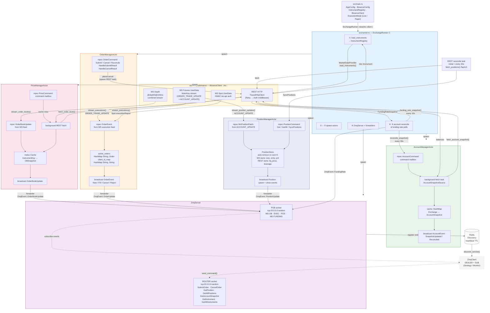

```mermaid
flowchart TD
    %% ── Entry ──────────────────────────────────────────────────
    MAIN["src/main.rs\nAppConfig · BinanceConfig\nInstrumentRegistry · BinanceClient\nExecutionMode (Live / Paper)"]

    MAIN -->|"ExchangeRunner::new(Arc·client·)"| RUNNER

    subgraph RUNNER["src/runner.rs — ExchangeRunner·C·"]
        direction TB
        STARTUP["① load_instruments\n→ InstrumentRegistry"]
        SPAWN["② – ⑤ spawn actors"]
        ZMQ_SETUP["⑥ ZmqServer + forwarders"]
        LOOPS["⑧ ⑨ account reconcile\n& funding rate polls"]
    end

    %% ── Exchange connector ─────────────────────────────────────
    subgraph BIN["exchanges/binance — BinanceClient · Arc ·"]
        REST["REST HTTP\nTracedHttpClient\n(Retry → Auth middleware)"]
        WS_DEPTH["WS Depth\n@depth5@100ms\ncombined stream"]
        WS_FUTURES["WS Futures UserData\nlistenKey stream\n(ORDER_TRADE_UPDATE\n+ ACCOUNT_UPDATE)"]
        WS_SPOT["WS Spot UserData\nHMAC ws-api auth"]
    end

    STARTUP -->|"MarketDataProvider\n.load_instruments()"| REST
    REST -->|"Vec·Instrument·"| STARTUP

    %% ── Account Manager Actor ──────────────────────────────────
    subgraph ACCT["AccountManagerActor"]
        ACMD["mpsc·AccountCommand·\ncommand mailbox"]
        AFETCH["background fetch task\nAccountSnapshotSource"]
        ACACHE["cache: HashMap\nExchange → AccountSnapshot"]
        ABCAST["broadcast·AccountEvent·\nSnapshotUpdated / Reconciled"]
    end

    RUNNER -->|"spawn"| ACCT
    ACMD --> AFETCH
    AFETCH -->|"fetch_account_snapshot()"| REST
    REST -->|"balances"| AFETCH
    AFETCH --> ACACHE
    ACACHE --> ABCAST

    LOOPS -->|"reconcile_snapshot()\nevery 30s"| ACMD

    %% ── Price Manager Actor ────────────────────────────────────
    subgraph PRICE["PriceManagerActor"]
        PCMD["mpsc·PriceCommand·\ncommand mailbox"]
        WSQ["mpsc·OrderBookUpdate·\nfrom WS feed"]
        RFETCH["background REST fetch"]
        PCACHE["moka::Cache\nInstrumentKey → OBSnapshot"]
        PBCAST["broadcast·OrderBookUpdate·"]
    end

    RUNNER -->|"spawn"| PRICE
    WS_DEPTH -->|"stream_order_books()"| WSQ
    WSQ --> PCACHE
    PCACHE --> PBCAST
    PCMD -->|"cache miss"| RFETCH
    RFETCH -->|"fetch_order_book()"| REST
    REST --> RFETCH
    RFETCH --> PCACHE

    %% ── Order Manager Actor ────────────────────────────────────
    subgraph ORDER["OrderManagerActor"]
        OCMD["mpsc·OrderCommand·\nSubmit / Cancel / Reconcile\nHandleSubmitResult\nHandleCancelResult"]
        OWS["mpsc·OrderEvent·\nfrom WS execution feed"]
        OSTATE["active_orders:\nHashMap·String, Order·\nclient_id_map:\nHashMap·String, String·"]
        OBCAST["broadcast·OrderEvent·\nNew / Fill / Cancel / Reject"]
    end

    RUNNER -->|"spawn"| ORDER
    WS_FUTURES -->|"stream_executions()\nORDER_TRADE_UPDATE"| OWS
    WS_SPOT -->|"stream_executions()\nSpot executionReport"| OWS
    OWS --> OSTATE
    OSTATE --> OBCAST
    OCMD -->|"place/cancel\n(spawn REST task)"| REST

    %% ── Position Manager Actor ─────────────────────────────────
    subgraph POS["PositionManagerActor"]
        POSCMD["mpsc·PositionCommand·\nGet / GetAll / SyncPositions"]
        POSWS["mpsc·WsPositionPatch·\nfrom ACCOUNT_UPDATE"]
        POSSTORE["PositionStore\nauto-remove on size=0\nWS owns: size, entry, pnl\nREST owns: liq_price, leverage"]
        POSBCAST["broadcast·Position·\nupsert + close events"]
    end

    RUNNER -->|"spawn"| POS
    WS_FUTURES -->|"stream_position_updates()\nACCOUNT_UPDATE"| POSWS
    POSWS --> POSSTORE
    POSSTORE --> POSBCAST

    POS_REST["REST reconcile task\ninitial + every 30s\nfetch_positions() /fapi/v3"]
    POS_REST -->|"SyncPositions"| POSCMD
    POS_REST -->|"fetch"| REST
    POSCMD --> POSSTORE

    %% ── ZMQ Layer ──────────────────────────────────────────────
    subgraph ZMQ["ZmqServer"]
        PUB_SOCK["PUB socket\ntcp://0.0.0.0:random\nMD.OB · EXEC · POS · MD.FUNDING"]
        ROUTER_SOCK["ROUTER socket\ntcp://0.0.0.0:random\nSubmitOrder · CancelOrder\nGetPosition · GetAllPositions\nGetAccountSnapshot\nGetInstrument · GetAllInstruments"]
    end

    REDIS[("Redis\nDiscovery\nheartbeat TTL")]

    ZMQ_SETUP -->|"spawn"| ZMQ
    ZMQ -->|"register endpoints"| REDIS

    %% ── forwarders ─────────────────────────────────────────────
    PBCAST -->|"forwarder\nZmqEvent::OrderBookUpdate"| PUB_SOCK
    OBCAST -->|"forwarder\nZmqEvent::OrderUpdate"| PUB_SOCK
    POSBCAST -->|"forwarder\nZmqEvent::PositionUpdate"| PUB_SOCK

    LOOPS -->|"funding_rate_snapshot()\nevery 10s"| REST
    REST -->|"FundingRateSnapshot"| LOOPS
    LOOPS -->|"ZmqEvent::FundingRate"| PUB_SOCK

    %% ── External clients ───────────────────────────────────────
    ZMQCLIENT["ZmqClient\nDEALER + SUB\n(Strategy / Monitor)"]
    REDIS -->|"discover_service()"| ZMQCLIENT
    PUB_SOCK -.->|"subscribe events"| ZMQCLIENT
    ZMQCLIENT -.->|"send_command()"| ROUTER_SOCK

    %% ── Styling ────────────────────────────────────────────────
    style BIN fill:#fff8e1,stroke:#f9a825
    style RUNNER fill:#e3f2fd,stroke:#1565c0
    style ACCT fill:#e8f5e9,stroke:#2e7d32
    style PRICE fill:#fce4ec,stroke:#880e4f
    style ORDER fill:#fff3e0,stroke:#e65100
    style POS fill:#e8eaf6,stroke:#283593
    style ZMQ fill:#f3e5f5,stroke:#6a1b9a
    style REDIS fill:#fafafa,stroke:#616161
    style ZMQCLIENT fill:#f5f5f5,stroke:#bbb,stroke-dasharray:5
```
