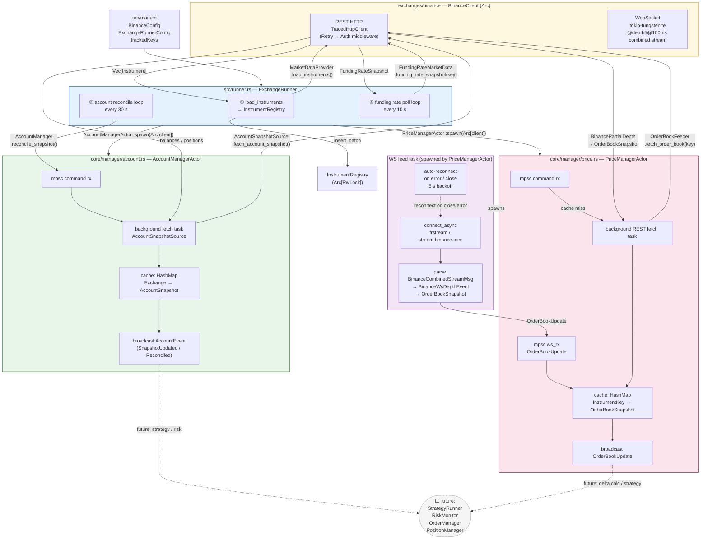

```mermaid
flowchart TD
    subgraph BIN["exchanges/binance — BinanceClient (Arc)"]
        REST["REST HTTP\nTracedHttpClient\n(Retry → Auth middleware)"]
        WS["WebSocket\ntokio-tungstenite\n@depth5@100ms combined stream"]
    end

    subgraph RUNNER["src/runner.rs — ExchangeRunner"]
        STARTUP["① load_instruments\n→ InstrumentRegistry"]
        ACCT_LOOP["③ account reconcile loop\nevery 30 s"]
        FR_LOOP["④ funding rate poll loop\nevery 10 s"]
    end

    subgraph ACCT_ACTOR["core/manager/account.rs — AccountManagerActor"]
        ACMD["mpsc command rx"]
        AFETCH["background fetch task\nAccountSnapshotSource"]
        ACACHE["cache: HashMap\nExchange → AccountSnapshot"]
        ABCAST["broadcast AccountEvent\n(SnapshotUpdated / Reconciled)"]
    end

    subgraph PRICE_ACTOR["core/manager/price.rs — PriceManagerActor"]
        PCMD["mpsc command rx"]
        WSQ["mpsc ws_rx\nOrderBookUpdate"]
        RFETCH["background REST fetch task"]
        PCACHE["cache: HashMap\nInstrumentKey → OrderBookSnapshot"]
        PBCAST["broadcast OrderBookUpdate"]
    end

    subgraph WS_TASK["WS feed task (spawned by PriceManagerActor)"]
        WSCONN["connect_async\nfrstream / stream.binance.com"]
        PARSE["parse BinanceCombinedStreamMsg\n→ BinanceWsDepthEvent\n→ OrderBookSnapshot"]
        AUTO["auto-reconnect\n on error / close\n5 s backoff"]
    end

    MAIN["src/main.rs\nBinanceConfig\nExchangeRunnerConfig\ntrackedKeys"] --> RUNNER

    STARTUP -->|"MarketDataProvider\n.load_instruments()"| REST
    REST -->|"Vec[Instrument]"| STARTUP
    STARTUP -->|"insert_batch"| REG["InstrumentRegistry\n(Arc[RwLock])"]

    RUNNER -->|"AccountManagerActor::spawn(Arc[client])"| ACCT_ACTOR
    RUNNER -->|"PriceManagerActor::spawn(Arc[client])"| PRICE_ACTOR

    ACCT_LOOP -->|"AccountManager\n.reconcile_snapshot()"| ACMD
    ACMD --> AFETCH
    AFETCH -->|"AccountSnapshotSource\n.fetch_account_snapshot()"| REST
    REST -->|"balances / positions"| AFETCH
    AFETCH --> ACACHE
    ACACHE --> ABCAST
    ABCAST -.->|"future: strategy / risk"| DOWNSTREAM

    FR_LOOP -->|"FundingRateMarketData\n.funding_rate_snapshot(key)"| REST
    REST -->|"FundingRateSnapshot"| FR_LOOP

    PRICE_ACTOR -->|"spawns"| WS_TASK
    WSCONN --> PARSE
    PARSE -->|"OrderBookUpdate"| WSQ
    WSQ --> PCACHE
    PCACHE --> PBCAST
    PBCAST -.->|"future: delta calc / strategy"| DOWNSTREAM

    PCMD -->|"cache miss"| RFETCH
    RFETCH -->|"OrderBookFeeder\n.fetch_order_book(key)"| REST
    REST -->|"BinancePartialDepth\n→ OrderBookSnapshot"| RFETCH
    RFETCH --> PCACHE

    AUTO -.->|"reconnect on close/error"| WSCONN

    DOWNSTREAM(["⬜ future:\nStrategyRunner\nRiskMonitor\nOrderManager\nPositionManager"])

    style DOWNSTREAM fill:#f5f5f5,stroke:#bbb,stroke-dasharray:5
    style BIN fill:#fff8e1,stroke:#f9a825
    style RUNNER fill:#e3f2fd,stroke:#1565c0
    style ACCT_ACTOR fill:#e8f5e9,stroke:#2e7d32
    style PRICE_ACTOR fill:#fce4ec,stroke:#880e4f
    style WS_TASK fill:#f3e5f5,stroke:#6a1b9a
```
