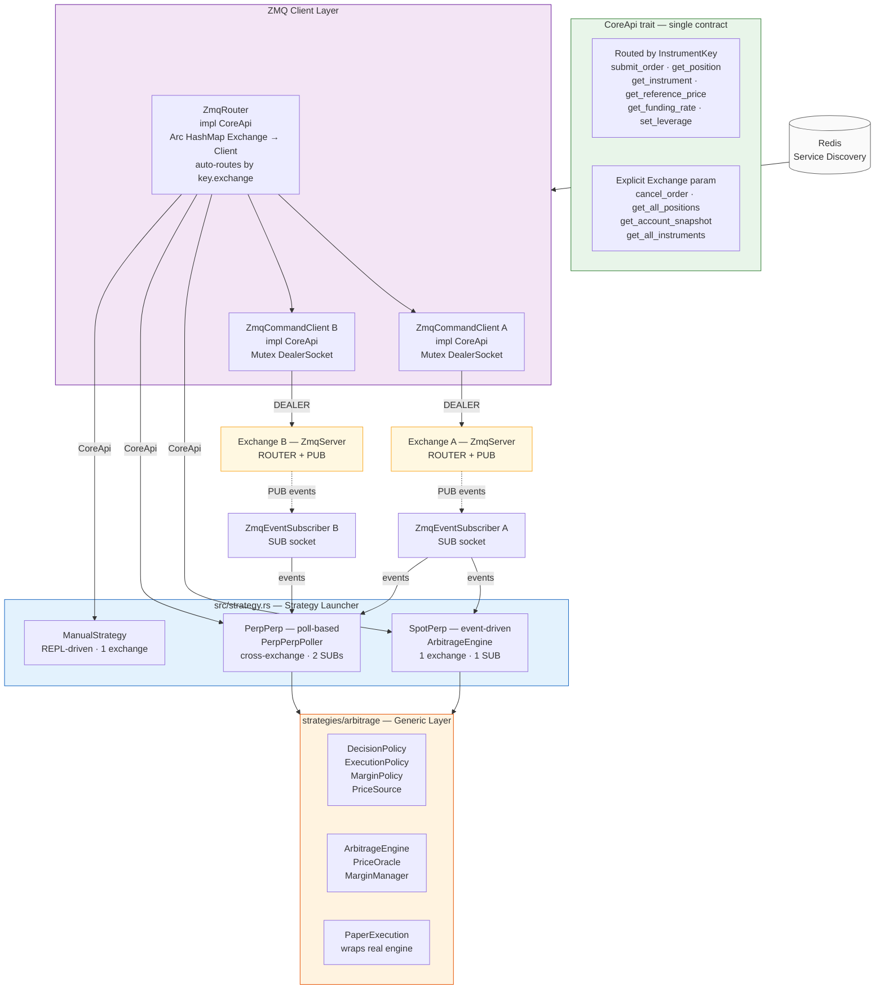

# Architecture Diagrams

## Part 1 — Exchange Runner (Server Side)

Each exchange runs as its own `ExchangeRunner` process. It wires actors, exchange
connectors, and a ZMQ server that exposes data to external clients.

```mermaid
flowchart TD
    %% ── Entry ──────────────────────────────────────────────────
    MAIN["src/main.rs<br/>AppConfig · BinanceClient<br/>ExecutionMode"]

    MAIN -->|"ExchangeRunner::new"| RUNNER

    subgraph RUNNER["src/runner.rs — ExchangeRunner"]
        direction TB
        STARTUP["① load_instruments"]
        SPAWN["② – ⑤ spawn actors"]
        ZMQ_SETUP["⑥ ZmqServer + forwarders"]
        LOOPS["⑧ ⑨ reconcile + funding polls"]
    end

    %% ── Exchange connector ─────────────────────────────────────
    subgraph BIN["exchanges/binance — BinanceClient"]
        REST["REST HTTP<br/>TracedHttpClient<br/>Retry → Auth middleware"]
        WS_DEPTH["WS Depth<br/>@depth5@100ms"]
        WS_FUTURES["WS Futures UserData<br/>ORDER_TRADE_UPDATE<br/>ACCOUNT_UPDATE"]
        WS_SPOT["WS Spot UserData<br/>HMAC ws-api auth"]
    end

    STARTUP -->|"load_instruments()"| REST
    REST -->|"Vec Instrument"| STARTUP

    %% ── Account Manager Actor ──────────────────────────────────
    subgraph ACCT["AccountManagerActor"]
        ACMD["mpsc AccountCommand"]
        AFETCH["background fetch task"]
        ACACHE["cache: Exchange → AccountSnapshot"]
        ABCAST["broadcast AccountEvent"]
    end

    RUNNER -->|"spawn"| ACCT
    ACMD --> AFETCH
    AFETCH -->|"fetch_account_snapshot()"| REST
    REST -->|"balances"| AFETCH
    AFETCH --> ACACHE
    ACACHE --> ABCAST

    LOOPS -->|"reconcile every 30s"| ACMD

    %% ── Price Manager Actor ────────────────────────────────────
    subgraph PRICE["PriceManagerActor"]
        PCMD["mpsc PriceCommand"]
        WSQ["mpsc OrderBookUpdate<br/>from WS feed"]
        RFETCH["background REST fetch"]
        PCACHE["moka Cache<br/>InstrumentKey → OBSnapshot"]
        PBCAST["broadcast OrderBookUpdate"]
    end

    RUNNER -->|"spawn"| PRICE
    WS_DEPTH -->|"stream_order_books()"| WSQ
    WSQ --> PCACHE
    PCACHE --> PBCAST
    PCMD -->|"cache miss"| RFETCH
    RFETCH -->|"fetch_order_book()"| REST
    REST --> RFETCH
    RFETCH --> PCACHE

    %% ── Order Manager Actor ────────────────────────────────────
    subgraph ORDER["OrderManagerActor"]
        OCMD["mpsc OrderCommand<br/>Submit / Cancel / Reconcile"]
        OWS["mpsc OrderEvent<br/>from WS execution feed"]
        OSTATE["active_orders + client_id_map"]
        OBCAST["broadcast OrderEvent<br/>New / Fill / Cancel / Reject"]
    end

    RUNNER -->|"spawn"| ORDER
    WS_FUTURES -->|"stream_executions()"| OWS
    WS_SPOT -->|"stream_executions()"| OWS
    OWS --> OSTATE
    OSTATE --> OBCAST
    OCMD -->|"place/cancel REST"| REST

    %% ── Position Manager Actor ─────────────────────────────────
    subgraph POS["PositionManagerActor"]
        POSCMD["mpsc PositionCommand<br/>Get / GetAll / Sync"]
        POSWS["mpsc WsPositionPatch<br/>from ACCOUNT_UPDATE"]
        POSSTORE["PositionStore<br/>auto-remove on size=0"]
        POSBCAST["broadcast Position<br/>upsert + close events"]
    end

    RUNNER -->|"spawn"| POS
    WS_FUTURES -->|"stream_position_updates()"| POSWS
    POSWS --> POSSTORE
    POSSTORE --> POSBCAST

    POS_REST["REST reconcile<br/>initial + every 30s"]
    POS_REST -->|"SyncPositions"| POSCMD
    POS_REST -->|"fetch"| REST
    POSCMD --> POSSTORE

    %% ── ZMQ Layer ──────────────────────────────────────────────
    subgraph ZMQ["ZmqServer"]
        PUB_SOCK["PUB socket<br/>OB · EXEC · POS · FUNDING"]
        ROUTER_SOCK["ROUTER socket<br/>CoreApi commands via rkyv"]
    end

    REDIS[("Redis<br/>Service Discovery")]

    ZMQ_SETUP -->|"spawn"| ZMQ
    ZMQ -->|"register endpoints"| REDIS

    %% ── forwarders ─────────────────────────────────────────────
    PBCAST -->|"ZmqEvent::OrderBookUpdate"| PUB_SOCK
    OBCAST -->|"ZmqEvent::OrderUpdate"| PUB_SOCK
    POSBCAST -->|"ZmqEvent::PositionUpdate"| PUB_SOCK

    LOOPS -->|"funding_rate_snapshot()"| REST
    REST -->|"FundingRateSnapshot"| LOOPS
    LOOPS -->|"ZmqEvent::FundingRate"| PUB_SOCK

    %% ── Styling ────────────────────────────────────────────────
    style BIN fill:#fff8e1,stroke:#f9a825
    style RUNNER fill:#e3f2fd,stroke:#1565c0
    style ACCT fill:#e8f5e9,stroke:#2e7d32
    style PRICE fill:#fce4ec,stroke:#880e4f
    style ORDER fill:#fff3e0,stroke:#e65100
    style POS fill:#e8eaf6,stroke:#283593
    style ZMQ fill:#f3e5f5,stroke:#6a1b9a
    style REDIS fill:#fafafa,stroke:#616161
```

## Part 2 — Strategy Client (CoreApi / ZmqRouter)

Strategies run as separate processes. They discover exchange ZMQ servers via Redis,
build a `ZmqRouter` (client-side), and interact through the `CoreApi` trait.

